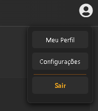

# 🚀 Java Quick Guide - Full Stack Project

Um guia interativo para aprendizado de Java, construído com uma arquitetura moderna separando o **Frontend** (React) do **Backend** (Spring Boot), com persistência de dados real em **PostgreSQL**.


---

## 🛠️ Tecnologias Utilizadas

### **Backend**
* **Java 21** & **Spring Boot 3**
* **Spring Data JPA**: Abstração de banco de dados.
* **Spring Security & JWT**: Preparado para autenticação.
* **PostgreSQL**: Banco de dados relacional robusto.
* **Lombok**: Para um código Java mais limpo.

### **Frontend**
* **React**: Biblioteca para interfaces dinâmicas.
* **Vite**: Ferramenta de build rápida.
* **React Syntax Highlighter**: Para exibição elegante de códigos Java.
* **CSS Moderno**: Layout responsivo e interativo.

---

## 🏗️ Estrutura do Projeto

O repositório está organizado de forma clara para facilitar a manutenção:

- `backend/`: Código fonte da API Java, configurações do Maven e banco de dados.
- `frontend/`: Interface do usuário em React e consumo da API.

---

## 🚀 Como Executar o Projeto

### 1. Pré-requisitos
* Java JDK 17 ou superior.
* Node.js instalado.
* PostgreSQL rodando localmente.

### 2. Configuração do Banco de Dados
No seu terminal PostgreSQL ou pgAdmin, crie o banco:
```sql
CREATE DATABASE guia_java;
```

### 3. Rodando o Backend
* **Navegue até a pasta: ´cd backend´**
* **Configure a senha do seu banco no arquivo**
  - `src/main/resources/application.properties`
* **Navegue até a pasta: cd backend** 
```sql
./mvnw spring-boot:run
```

### 4. Rodando o Frontend
* **Navegue até a pasta: `cd frontend`**
* **Instale as dependências:**
```sql
npm install
```
* **Inicie o servidor de desenvolvimento:**
```sql
npm run dev
```
* **Acesse o projeto em: `http://localhost:5173`**

## 📂 Estrutura do Projeto

* `src/assets/` -> Imagens e ícones do sistema
* `src/components/` -> Componentes da interface
* `src/App.jsx` -> Componente mestre e lógica de filtros
* `src/main.jsx` -> Ponto de entrada do React

## 🖼️ Screenshots

<div align="center">     </div

---
Desenvolvido com ☕ e React por **Rian**
