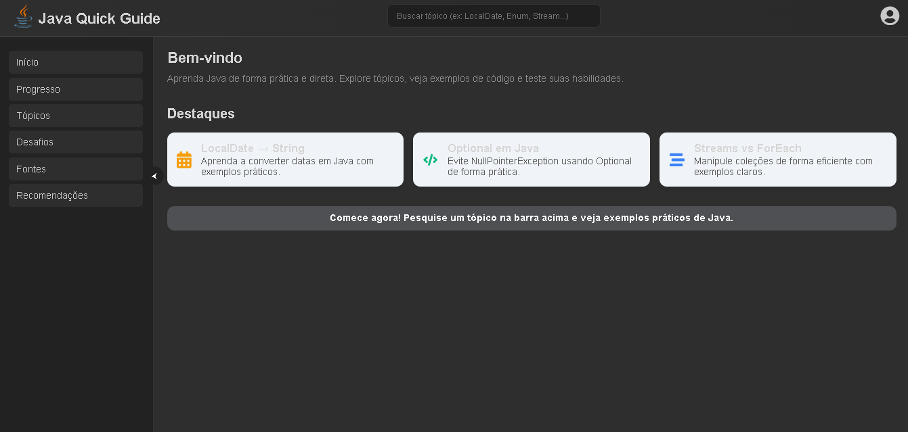
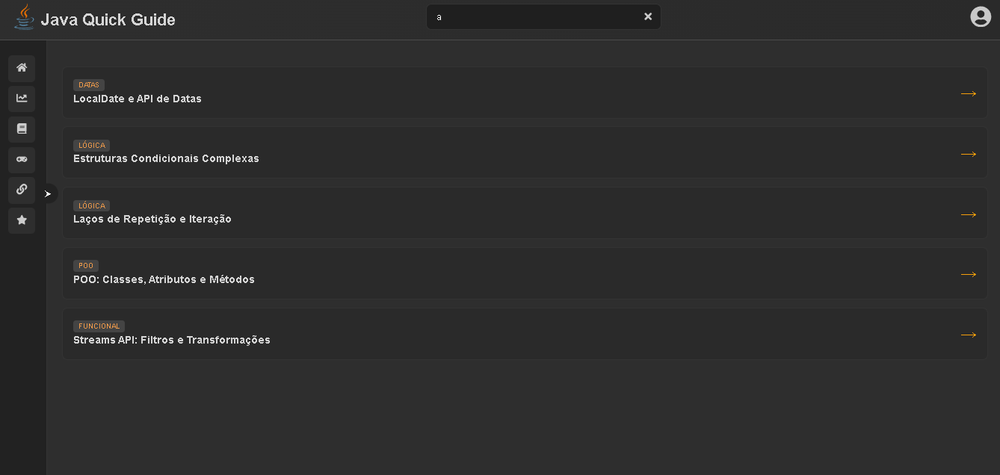
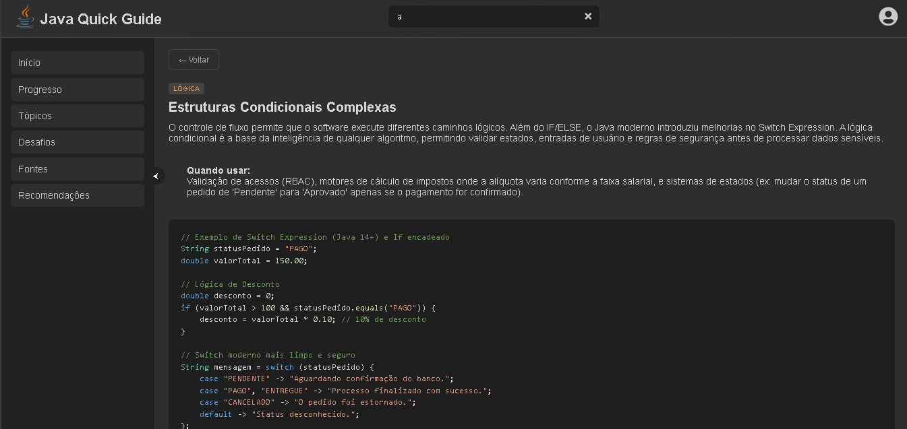

<<<<<<< HEAD
# java-quick-guide
Guia rápido de Java com exemplos práticos, feito com Java + Spring Boot e React.
=======
# ☕ Java Learning Guide

Um guia interativo e moderno para consulta rápida de conceitos fundamentais e avançados da linguagem Java. Este projeto foi desenvolvido para auxiliar desenvolvedores a revisarem sintaxes, regras de negócio e casos de uso de forma visual e organizada.

---

## 🚀 Funcionalidades

- **Busca em Tempo Real:** Filtro inteligente que busca por títulos ou descrições entre os tópicos.
- **Visualização Detalhada:** Explicações profundas incluindo "O que é", "Quando usar" e "Nível de dificuldade".
- **Snippets de Código:** Exemplos práticos formatados com foco em legibilidade.
- **Interface Dark Mode:** Design focado em conforto visual (UI/UX) para desenvolvedores.
- **Scroll Customizado:** Sistema de navegação fluida com barra de rolagem oculta.

## 🛠️ Tecnologias Utilizadas

- **React.js**: Biblioteca base para a construção da interface.
- **Vite**: Ferramenta de build ultra-rápida.
- **CSS3**: Estilização moderna com Flexbox e seletores avançados.
- **JavaScript (ES6+)**: Lógica de filtragem e manipulação de estados.

## 📚 Tópicos Cobertos

O guia abrange as principais áreas da linguagem:
* **Fundamentos:** Estruturas de repetição, condicionais e tipos de dados.
* **POO:** Classes, Herança, Interfaces, Polimorfismo e Encapsulamento.
* **Java Moderno (8+):** Streams API, Optional, Lambda Expressions e API de Datas.
* **Performance:** Manipulação de Strings com StringBuilder e Records.

## 💻 Como Rodar o Projeto Localmente

1. **Clone o repositório:**
   git clone https://github.com/Rianzynx/java-quick-guide

2. **Instale as dependências:**
   npm install

3. **Inicie o ambiente de desenvolvimento:**
   npm run dev

4. **Para gerar a versão final (Build):**
   npm run build

## 📂 Estrutura do Projeto

* `src/assets/` -> Imagens e ícones do sistema
* `src/components/` -> Componentes da interface
* `src/data/topics.js` -> Banco de dados estático
* `src/App.jsx` -> Componente mestre e lógica de filtros
* `src/main.jsx` -> Ponto de entrada do React

## 🖼️ Screenshots

1. **Pagina inicial**

2. **Resultado da pesquisa**

3. **Pesquisa em detalhe**

---
Desenvolvido com ☕ e React por **Rian**
>>>>>>> 9fc27a8 (Add screenshots to README)
